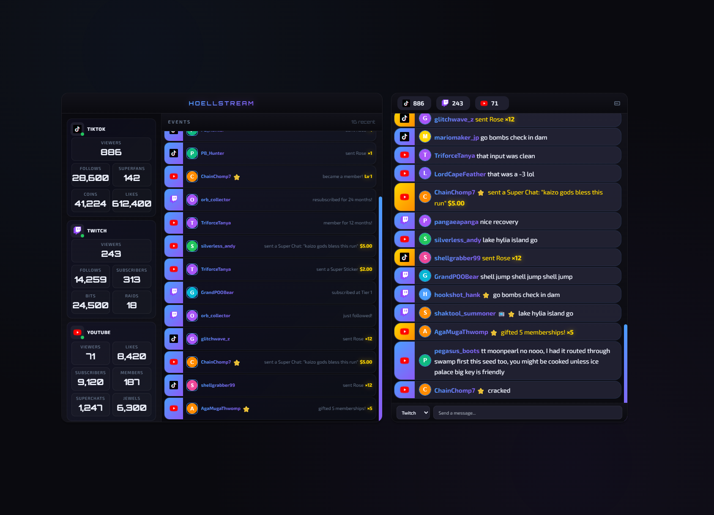

HoellStream displays TikTok, Twitch, and YouTube chats and stream events in two separate windows:

▶ **[Try the interactive demo in your browser](https://lordhoell.github.io/HoellStream/)**

**Overlay:** stream events like follows, subs, bits, superchats, and more  
**Chat:** unified chat feed from TikTok, Twitch, and YouTube

## Prerequisites:
* EulerStream Account: API Key for TikTok
* Twitch Dev Console App: Client ID and Client Secret
* Google Cloud Console App: Client ID and Client Secret

## Launch the app
Double-click the provided HoellStream.exe to open both Overlay and Chat windows

## Edit configuration
* Open the app menu and select Settings
* Enter your client ID and client Secret for both Twitch and YouTube.
* Click Save.
* Click Log into Twitch
* Click Log into YouTube
* Click Save

## Reload windows
Use the "Reload" menu item to refresh both Overlay and Chat windows after saving

## How to obtain Client ID and Client Secrets

### TikTok
* Go to https://www.eulerstream.com/register
* Create an account
* Log into your account
* Navigate to your Dashboard to create an API Key
* Note down your API Key
* Enter the API Key in HoellStream Settings

### Twitch
* Go to https://dev.twitch.tv/console/apps
* Click Register Your Application
  * Name: HoellStream_[YourTwitchName]
  * OAuth Redirect URLs: http://localhost:4391/twitch-callback
  * Category: Chatbot
  * Client Type: Confidential
* Note down the Client ID
* Save
* Click New Secret
* Note down the Client Secret
* Save

## Youtube
First you need to create the project
* Go to https://console.cloud.google.com/
* Create a new project
* Click hamburger menu > APIs & Services > Enabled API & Services
* Click + Enable APIs and services
* Enable YouTube Data API v3
* Click hamburger menu > APIs & Services > OAuth Consent Screen
* Click Data Access
* Add or Remove Scopes
* Add the scopes
  * .../auth/youtube.readonly
  * .../auth/cloud-translation
  * .../auth/youtube
  * .../auth/youtube.force-ssl
* Click Update

Then you have to create the client
* Click hamburger menu > APIs & Services > OAuth Consent Screen
* Redirect URL: http://localhost:4390/youtube-callback
* Click Clients
* Click + Create Client
  * Application Type: Desktop
  * Name: HoellStream
* Download the JSON that is provided on the next screen
* Note down the Client ID and Secret

Finally you have to authorize yourself as a test user
* Click hamburger menu > APIs & Services > OAuth Consent Screen
* Click Audience
* Ensure App is in testing
* Add your YouTube account email as a test user

## Special Thanks:

* Ingrid Mb
* Jayzon Zane
* Germdove
